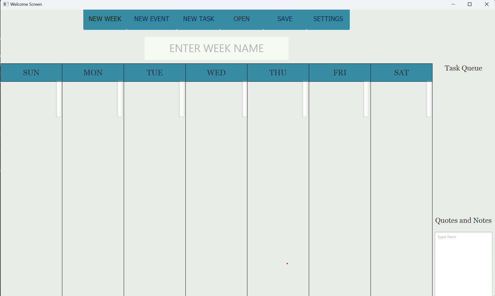

# 3500 PA05 Project Repo

[PA Write Up](https://markefontenot.notion.site/PA-05-8263d28a81a7473d8372c6579abd6481)

Are you tired of planning out your weeks by hand? Well look no further team Sabren has you covered. Our highly capable,
dynamic, and intelligent program allows you to play your weeks in minutes at your computer. Our program allows you to
plan out your tasks and events for the week, leaving the specifications to the user. You can create and add tasks, and 
events for each day of the week, keep track of your progress in completing them, and edit the layout in settings. Our
program keeps track of your data allowing you to store as many weeks as you want. The program has keyboard shortcuts. 
The program is fully fleshed out with cutting edge functionality, and we hope you like it.

This code is so super extensible. Any developer of any skill could easily add any feature they wanted.
The code is welcoming to new eyes and easy to understand, making it great for long term usage. By abstracting
our classes into interfaces, any new feature can easily be added by simply creating a new class that extends
the interface - such as the View and Controller interfaces. This allows new features to be added without
significantly modifying existing code.

## Single Responsibility Principle:

- Our program implements the single responsibility principle in the way in which we separated our classes and chose to implement methods. For example, our Day class only takes care of objects and information that would be stored on a singular day. It only handles getting and setting those methods, but doesn't do anything to process them. Similarly, our Week class works to store all information pertaining to a particular week. It handles the days stored within the week, as well as additional information about the week such as the max amount of events and tasks per day. In this way, our program does a good job of separating classes into individual tasks and responsibilities. 

## Open/Closed Principle:

- Our program implements the open/closed principle by making good use of interfaces and classes. Each class is closed for modification, meaning that all functionality that should be handled by the class is already handled. However, the interfaces (such as the View and Controller) are open for implementation in new classes. If another page were to be added, for example, one could just create a new View and Controller classes which could add to the program without significantly modifying existing code.

## Liskov Substitution Principle:

- Because of the way in which our program is set up, we have made good use of interfaces and classes that implement those interfaces. As a result of this, many of our classes are interchangeable for each other, as long as they implement the same interface. For example, our two View classes include the same methods and therefore would work the same regardless of which one was used. They both are loosely connected to a Controller, so as long as one was provided, they would be able to be used. Our BJFxApplication class loosely requires a Controller and View class, but does not expect a specific implementation of either.

## Interface Segregation Principle:

- In our code, we made sure that each interface was usable and useful. This should prevent any unnecessary interfaces, as well as any unnecessary methods. Each interface (and implementation) has a specific purpose and only adds to our code without making it overly complicated. Additionally, each method is used properly and has a purpose while helping to decouple our code. For example, our run methods in the Controller classes work to run the entire program, but they delegate to private helper methods that actually handle the functionality of our code. By making these helper methods private, it helps to allow each Controller class to decide how to specifically implement the run method and functionality without being tied to useless methods.

## Dependency Inversion Principle:

- Our code utilized the dependency inversion principle in the ways in which it has been abstracted in order to promote looser coupling between classes. Although this was difficult (specific Controllers depend on specific Views and vice versa), we were able to still accomplish this by again abstracting dependencies. We were able to make use of interfaces so that classes could just rely on interfaces, instead of specific implementations of the classes. No single class is directly tied to another- just interfaces which allow for looser coupling.